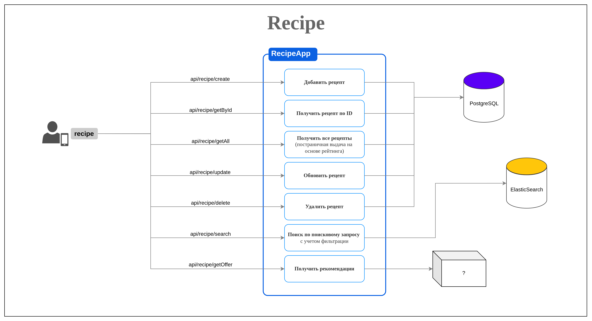

# API

## Сущности

1. Рецепт

## Описание сущности Рецепт

1. **Рецепт**
   - dish_id 
   - userId (owner)
   - name (6-50 символов)
   - description 
   - photo (ссылка на фото для preview)
   - cooking_time 
   - active_cooking_time 
   - portion_qnt 
   - proteins (на 1 порцию)
   - fats (на 1 порцию)
   - carbohydrates (на 1 порцию)
   - calories (на 1 порцию)
   - spiciness 
   - complexity_scale 
   - create_dt
2. **Ингредиенты** 
   - dish_id
   - ingredient_id
   - qnt (кол-во)
   - unit (CHAR[2] - ед. измерения - g (грамм) / ml (милилитр) / ct (count/штука))
3. **Стадии приготовления блюда** (этапы приготовления блюда с описанием и фотографией)
   - dish_id 
   - recipe_step_id 
   - description 
   - photo

## API

1. **Recipe**
   1. CRUDs
      - create
      - read (getById / getAll)
      - update
      - delete
      - search - поиск по фильтрам
   2. Дополнительные 
      - offers (поиск подходящих рецнптов на основе информации о избранных)
   
   